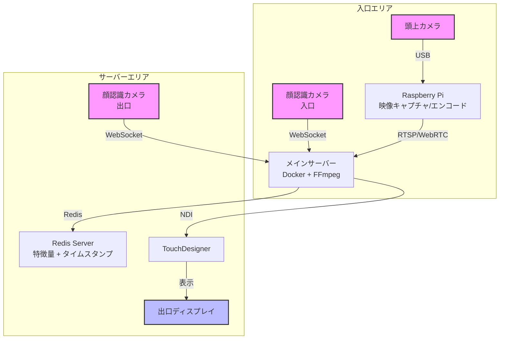
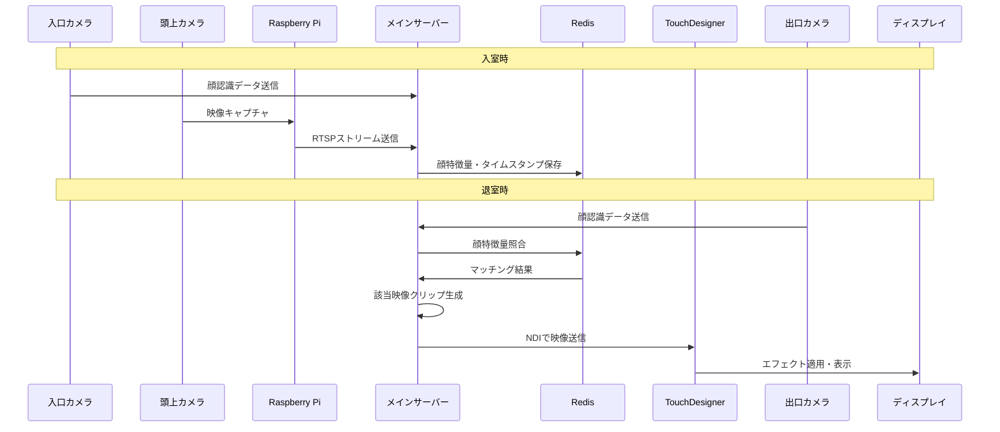

# Re:entrance 仕様

## 1. システム概要

このシステムは大宮祭（5月18日）のために開発される来場者インタラクションシステムです。入口と出口にカメラを設置し、来場者の入場時の映像を記録し、出口付近で遅延させた映像を表示することで、来場者に意外性のある体験を提供します。

## 2. システム構成

### 2.1 ハードウェア構成

- **頭上カメラ**: 入場者の様子を上から撮影（個人所有のWebカメラを使用）
- **顔認識カメラ**: 入口で来場者の顔を認識・識別（Logicool WebCam C920n）
- **出口表示装置**: 出口付近に設置され、来場者が自分の入場時の映像を見ることができる装置 (Logicool WebCam C922)
- **サーバー**: すべてのデバイスを接続し、データ処理を行うLAN内のサーバー
- **接続機器**: 10m USB延長ケーブル（カメラ接続用）

### 2.2 ソフトウェア構成

- **顔認識システム**: MediaPipeを使用した顔認識・個人識別システム
- **映像記録サーバー**: 頭上カメラからの映像を記録・保存するシステム
- **タイムスタンプ管理**: 入退室時間の記録と映像検索のためのシステム
- **TouchDesigner連携**: 入室時前後20秒の動画をTouchDesignerに入力するシステム

## 3. システムフロー

### 3.1 入室時のフロー

1. 来場者が入口に近づく
2. 頭上カメラが来場者の入室の様子を撮影・記録
3. 顔認識カメラが来場者の顔を認識・識別
4. システムは個人識別情報とタイムスタンプを記録
5. 映像データはサーバーに保存される

### 3.2 退室時のフロー

1. 来場者が出口に近づく
2. 出口の顔認識システムが来場者の顔を再度認識
3. システムは入室時の顔認識データと照合
4. 一致した場合、入室時のタイムスタンプを基に頭上カメラの映像を検索
5. 入室時前後20秒の映像をTouchDesignerに送信
6. TouchDesignerで処理された映像が出口付近の表示装置に表示される

## 4. 技術的実装詳細

### 4.1 顔認識システム

- **使用技術**: MediaPipe Face Detection API
- **機能**:
  - 顔の検出と識別
  - 個人の特徴点抽出と一時的なID生成
  - 入退室時の顔データ照合

### 4.2 映像記録システム

- **使用技術**: OpenCV / FFmpeg
- **機能**:
  - 頭上カメラからのリアルタイム映像取得
  - 映像のエンコードと保存
  - タイムスタンプベースの映像インデックス作成

### 4.3 サーバーシステム

- **アーキテクチャ**: クライアント・サーバーモデル
- **通信プロトコル**: WebSocket / HTTP
- **データ保存**: 一時的なデータベース（SQLite / Redis）
- **ネットワーク**: 閉じたLAN環境内での通信

### 4.4 TouchDesigner連携

- **インターフェース**: NDI / Spout / WebSocket
- **データ形式**: 映像ストリームまたはファイル
- **処理内容**: 映像の遅延表示、エフェクト適用など

## 5. 実装スケジュール

- **5月11日まで**: 基本システムの実装完了
  - 入室時の顔識別 & タイムスタンプ記録
  - 頭上カメラの記録サーバー
  - 退出時の顔識別 & タイムスタンプ検索
  - TouchDesignerへの映像入力

- **5月11日〜17日**: テストと調整
  - システム統合テスト
  - パフォーマンス最適化
  - エラー処理の改善

- **5月18日**: 大宮祭での展示・運用

## 6. 技術的課題と対策

### 6.1 顔認識の精度

- **課題**: 照明条件や角度による認識精度の低下
- **対策**: 
  - MediaPipeの高度な顔認識機能の活用
  - 複数の特徴点を組み合わせた識別アルゴリズムの実装
  - 認識失敗時のフォールバック処理の実装

### 6.2 システム遅延

- **課題**: リアルタイム処理による遅延
- **対策**:
  - 処理の最適化（GPU活用など）
  - バッファリング戦略の実装
  - 非同期処理の活用

### 6.3 データ管理

- **課題**: 一時的な個人データの安全な管理
- **対策**:
  - データの匿名化処理
  - イベント終了後のデータ完全削除
  - 閉じたネットワーク内でのみの運用

## 7. 拡張可能性

- **複数人の同時認識**: グループでの入場時の対応
- **インタラクティブ要素の追加**: 映像に対するリアルタイム操作機能
- **分析機能**: 来場者の統計データ収集（匿名化した上で）

## 8. セットアップ手順

1. ハードウェアの設置
   - 頭上カメラを入口上部に設置
   - 顔認識カメラを入口に設置
   - サーバーを安全な場所に設置
   - すべての機器をLANに接続

2. ソフトウェアのセットアップ
   - サーバーソフトウェアのインストールと設定
   - カメラキャリブレーション
   - 顔認識システムのテスト
   - TouchDesignerとの連携確認

3. システム全体のテスト
   - エンドツーエンドのフロー確認
   - エラーケースのテスト
   - パフォーマンステスト

## 9. 運用上の注意点

- システム起動は展示開始の30分前に行う
- 定期的なシステム状態の確認
- トラブル発生時の対応手順の準備
- バックアップ機器の準備

## 10. システムアーキテクチャ詳細

### 10.1 物理構成

システムは以下の2つの主要エリアで構成されます：

#### 入口エリア
- 頭上カメラ（USBカメラ）
- Raspberry Pi（映像キャプチャ・エンコードサーバー）
- 顔認識カメラ（入口）

#### サーバーエリア
- メインサーバー（Docker環境）
- 顔認識カメラ（出口）
- TouchDesigner実行環境
- 表示装置

### 10.2 コンポーネント詳細

#### Raspberry Pi 映像キャプチャサーバー
- **役割**: 頭上カメラからの映像取得とストリーミング
- **実装**:
  - H.264エンコーディング
  - RTSPストリーミングサーバー
  - 最小限の処理に限定し安定性を確保
- **出力**: RTSPストリーム（rtsp://localhost:8554/stream）

#### メインサーバー（Docker環境）
- **コンポーネント**:
  - 映像処理サーバー（FFmpeg）
  - 顔認識システム（MediaPipe）
  - Redisデータベース
  - WebSocketサーバー
- **機能**:
  - RTSPストリームの受信と処理
  - 顔認識データの処理と保存
  - NDIによるTouchDesigner連携

#### データストア（Redis）
- **保存データ**:
  - 顔特徴量
  - 入室タイムスタンプ
  - 一時的な参照データ
- **特徴**:
  - インメモリデータベース
  - 高速な類似度検索
  - イベント終了後のデータ自動削除

### 10.3 データフロー

1. **映像キャプチャフロー**
   - 頭上カメラ → Raspberry Pi → RTSPストリーム → メインサーバー
   - エンコード形式: H.264
   - フレームレート: 30fps
   - 解像度: 1920x1080

2. **顔認識フロー**
   - 入口カメラ → WebSocket → メインサーバー
   - 特徴量抽出 → Redis保存
   - 出口カメラでの照合 → 映像検索

3. **表示フロー**
   - メインサーバー → NDI → TouchDesigner
   - 20秒間の映像クリップ生成
   - エフェクト適用と表示

### 10.4 ネットワーク要件

- **有線LAN接続必須**
  - Raspberry Pi ⇔ メインサーバー間
  - 顔認識カメラ ⇔ メインサーバー間
- **推奨帯域**: 最低10Mbps以上
- **遅延要件**: RTT 50ms以下

### 10.5 エラー対策

- **自動再接続機能**
  - ネットワーク切断時の再接続
  - ストリーミングの自動復旧
- **監視システム**
  - コンポーネント状態の定期確認
  - エラーログの集中管理
- **フォールバック処理**
  - 顔認識失敗時の代替フロー
  - 一時的なデータ保存と復旧

### 10.6 システム構成図

### 10.7 シーケンス図

### 10.8 コンポーネント間の通信プロトコル詳細

1. **カメラ → サーバー通信**
   - 頭上カメラ: RTSP over TCP (port 8554)
   - 顔認識カメラ: WebSocket (port 8080)

2. **サーバー内部通信**
   - Redis: TCP (port 6379)
   - Docker間通信: 内部ネットワーク

3. **表示系通信**
   - NDI: UDP (port 5960-5968)
   - モニタリング: HTTP (port 8081)

---

*このドキュメントは開発進行に伴い更新される可能性があります。*
